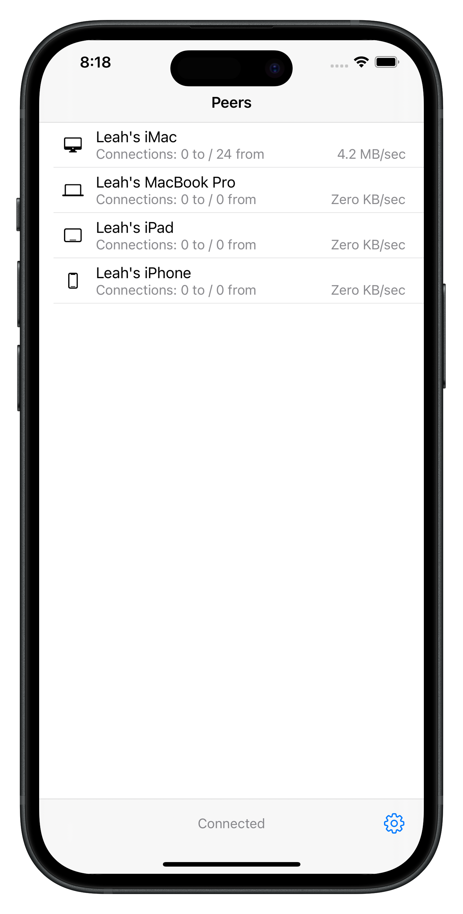
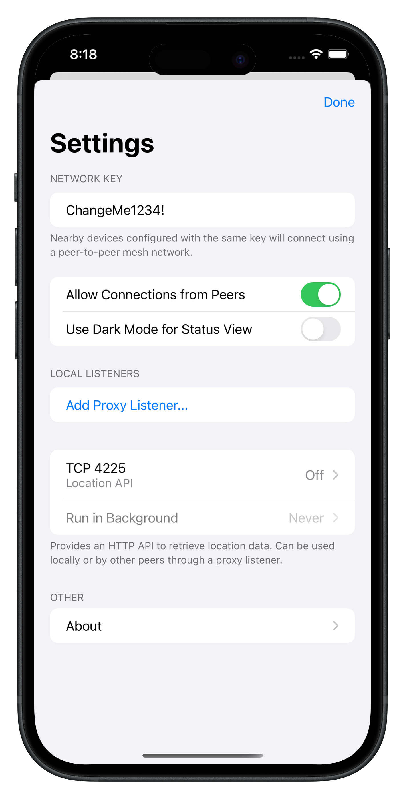
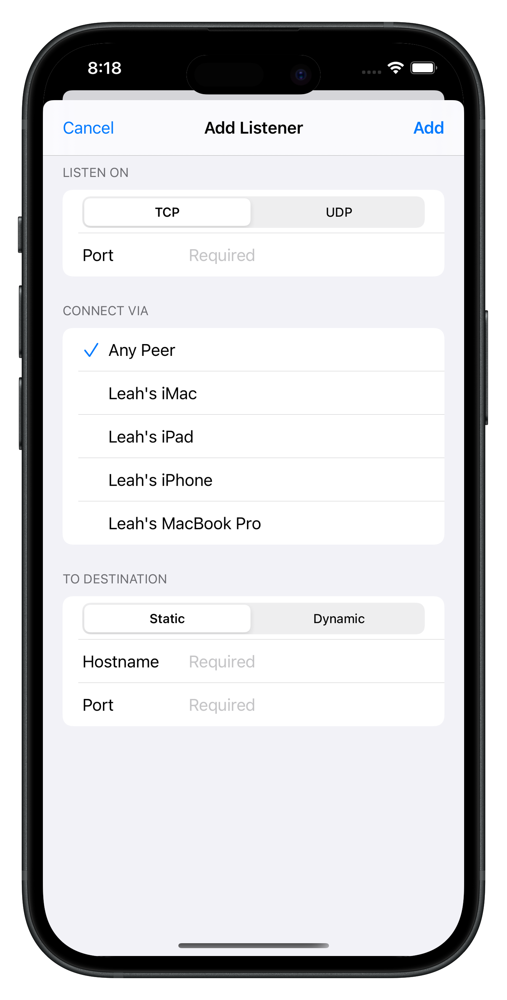
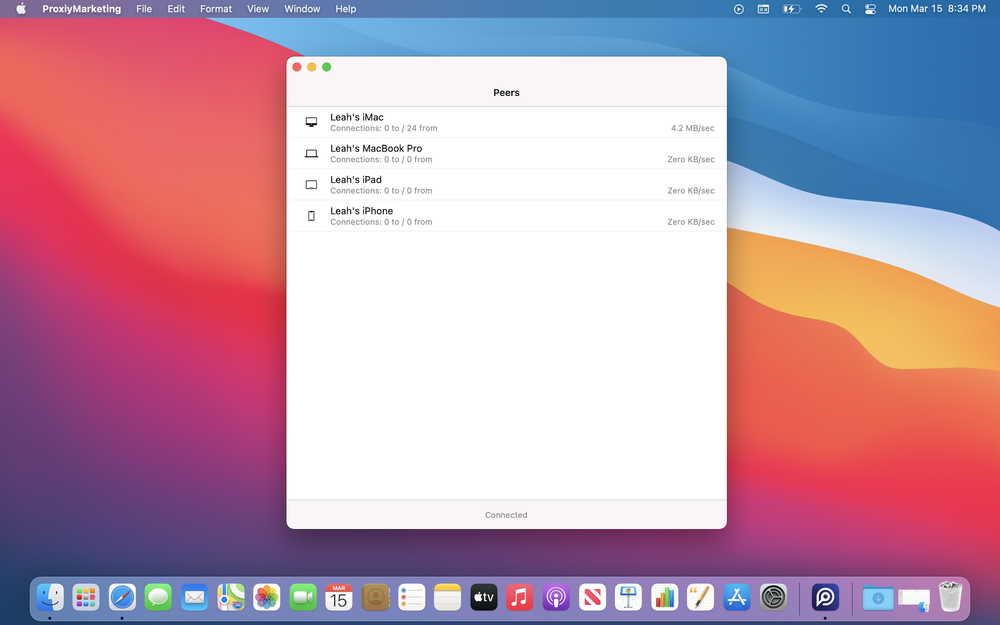
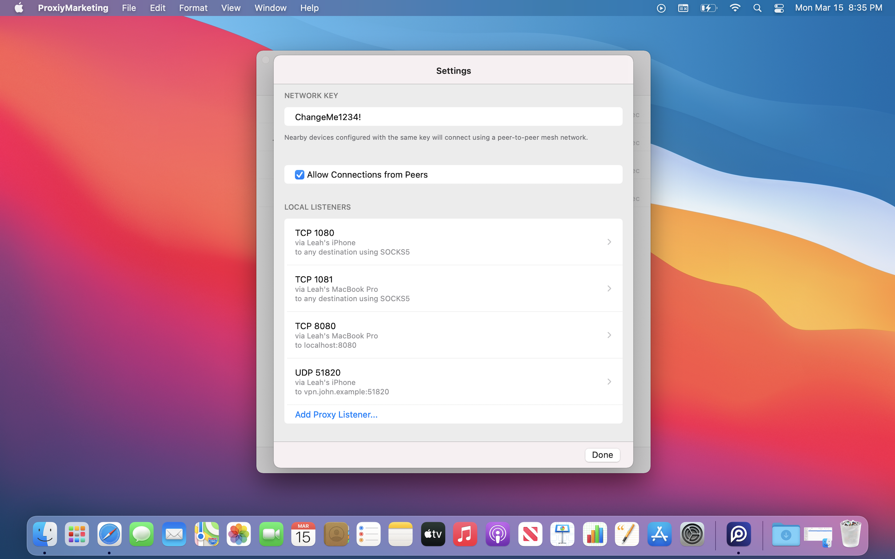
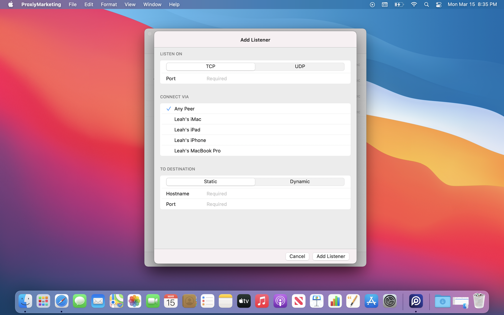

#  Proxiy

Proxiy allows you to make TCP, UDP, and SOCKS5 connections through your nearby Apple devices (iPhones, iPads, and Macs). It uses the same peer-to-peer Wi-Fi technology as AirDrop and AirPlay.

Use-cases include:

- Avoid tethering limitations of cellular plans :-)
- Selectively connect only a single Mac app through your iPhone, without using Personal Hotspot and redirecting all your traffic.
- Connect to services running on other devices when the Wi-Fi you’re on does not allow connections between clients.

## Screenshots

### iPhone

  

### Mac

  

## Getting started

1. Install Proxiy on the originating and the proxy device.
2. On the proxy device, in Proxiy settings, enable “Allow Connections from Peers”.
3. On the originating device, in Proxiy settings, add a localhost listener and configure it to route via the proxy device.

